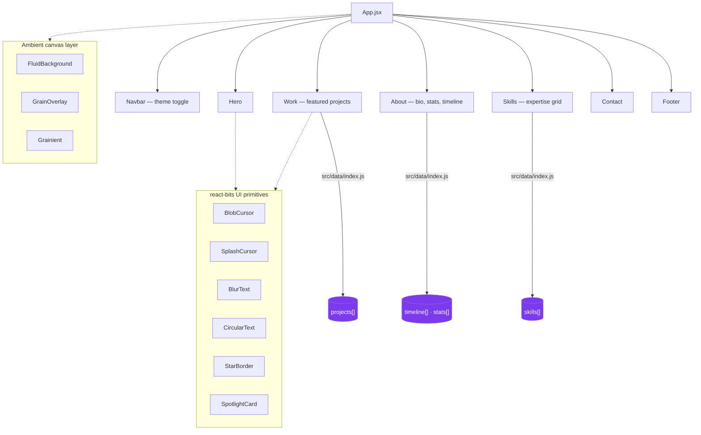

# Niranjan Patil — Portfolio

<div align="center">

**Code. Design. Ship.**
Personal portfolio showcasing full-stack, mobile & web projects — built as a fast, animated single-page site.

[](https://10niranjan.github.io/PortFolio)
[](https://github.com/10Niranjan/portfolio/actions)
[](https://react.dev)
[](https://vitejs.dev)

📧 [pvt.niranjan10@gmail.com](mailto:pvt.niranjan10@gmail.com) · 📍 Pune, India

</div>

---

## Overview

A single-page portfolio built with **React 19** and **Vite**, styled with a hand-built CSS design system plus **Tailwind CSS** utilities, and animated with **Framer Motion** / **GSAP**. Deploys automatically to **GitHub Pages** via GitHub Actions on every push to `main`.



---

## Tech Stack

### Portfolio site

| Layer | Technology |
|---|---|
| UI Framework | React 19 |
| Build Tool | Vite 8 |
| Styling | Tailwind CSS + custom CSS design system |
| Animation | Framer Motion · GSAP · `motion` |
| Interactive graphics | OGL (WebGL), custom `react-bits` primitives |
| Carousel | Swiper |
| Linting | ESLint 10 (flat config) |
| CI/CD | GitHub Actions → GitHub Pages |

### Skills reflected on the site

| Domain | Technologies |
|---|---|
| Mobile | Flutter · Dart · Firebase · Provider / Riverpod |
| Java & Spring backend | Java (8 · 17 · 21) · Spring Boot 3 · Spring MVC · Spring Data JPA · Spring Security |
| Web & frontend | React.js · JavaScript · HTML5 / CSS3 · Tailwind CSS |
| APIs & messaging | REST APIs · Apache Kafka · JWT / OAuth2 · WebSockets |
| Databases & DevOps | PostgreSQL · MongoDB · MySQL · Docker · Git / GitHub · CI/CD |

---

## Featured Projects

| Project | Stack | Status |
|---|---|---|
| [Svarae](https://svarae-app.vercel.app) — Premium eCommerce store | Next.js · Tailwind CSS · Zustand · Prisma · CockroachDB · Cloudinary | 🚧 In Development |
| Jyoti Traders — Closed B2B wholesale ordering app | Flutter · Riverpod · Firebase · Firestore · Hive | 🚧 In Development *(closed/invite-only, no live link)* |
| [Campus Connect](https://campus-connect-pied-eight.vercel.app) — Campus collaboration platform | React · Node.js · Express · MongoDB · Socket.io · Tailwind CSS | 🚧 In Development |
| [Prophecy Aesthetics](https://prophecy-nine.vercel.app) — Premium SPA web experience | HTML5 · Vanilla CSS · JavaScript · Vite | ✅ Live |

More on [github.com/10Niranjan](https://github.com/10Niranjan).

---

## Project Structure

```
src/
├── components/
│   ├── canvas/       # FluidBackground, GrainOverlay, Grainient — ambient WebGL/CSS backdrops
│   ├── layout/        # Navbar, Footer
│   ├── react-bits/    # BlobCursor, SplashCursor, BlurText, CircularText, StarBorder, SpotlightCard
│   ├── sections/       # Hero, Work, About, Skills, Contact, SpotifyPlayer
│   └── ui/             # SectionLabel, Timeline
├── data/
│   └── index.js        # single source of truth: personal info, projects, skills, timeline, stats
├── App.jsx
└── main.jsx
```

---

## Getting Started

```bash
git clone https://github.com/10Niranjan/portfolio.git
cd portfolio
npm install
npm run dev
```

| Command | Description |
|---|---|
| `npm run dev` | Start the Vite dev server |
| `npm run build` | Production build to `dist/` |
| `npm run preview` | Preview the production build locally |
| `npm run lint` | Run ESLint |

## Deployment

Every push to `main` triggers `.github/workflows/deploy.yml`, which builds the site with Node 20 and publishes `dist/` to **GitHub Pages** — live at [10niranjan.github.io/PortFolio](https://10niranjan.github.io/PortFolio).

---

<div align="center">

*Built with React + Vite · Designed & developed by [Niranjan Patil](https://github.com/10Niranjan)*

</div>
